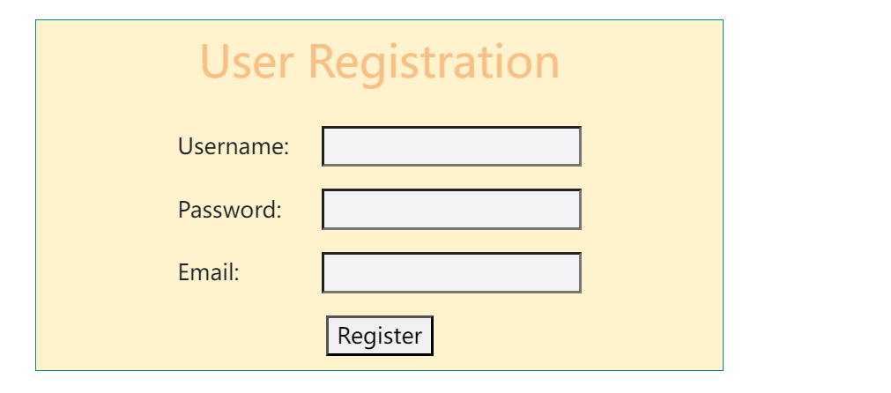
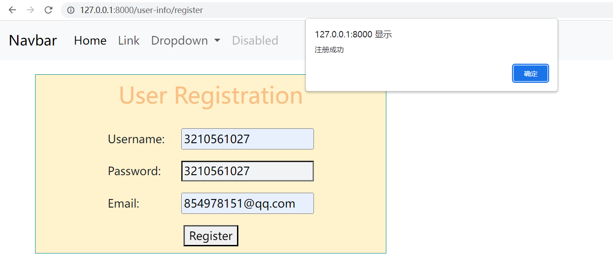
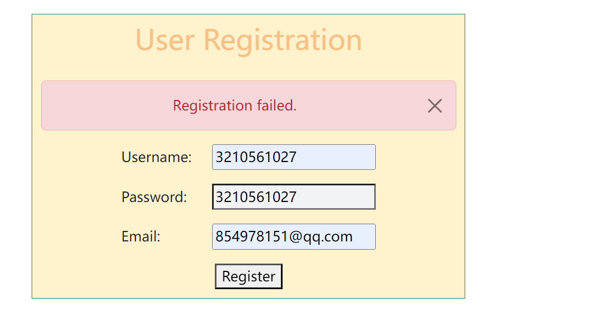
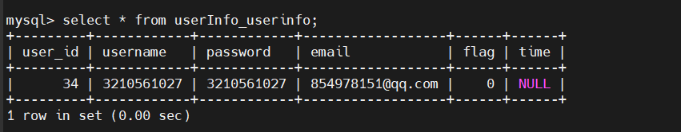

# Django实战


## 1. 项目介绍

## 2. 项目搭建
**本项目是使用`Django`框架所搭建的web服务**

```shell
# 创建一个Django项目，命名位course
django-admin startproject course
# 创建一个用户服务应用 
 python manage.py startapp userInfo
```

**模型激活**

​		为了在我们的工程中包含这个应用，我们需要在配置类 `INSTALLED_APPS`中添加设置。因为 `UserInfoConfig` 类写在文件 `UserInfo/apps.py` 中，所以它的点式路径是 `'userInfo.apps.UserInfoConfig'`。在文件 `course/settings.py` 中 `INSTALLED_APPS`子项添加点式路径后，它看起来像这样：

```cfg

INSTALLED_APPS = [
    'django.contrib.admin',
    'django.contrib.auth',
    'django.contrib.contenttypes',
    'django.contrib.sessions',
    'django.contrib.messages',
    'django.contrib.staticfiles',
    'userInfo.apps.UserinfoConfig'
]

```

```shell
DATABASES = {
    "default": {
        "ENGINE": "django.db.backends.mysql",
        "NAME": "python",
        "USER": "root",
        "PASSWORD": "123456",
        "HOST": "pogf.com.cn",
        "PORT": "3309",
    }
}
```


## 3. 用户服务介绍

### 1. 模型介绍

用户信息模型目前有以下五个内容：`user_id`,`username`,`password`,`email`,`flag`,`time`

-`user_id`：由数据库自动制定
-`username`：用户名
-`password`：用户密码
-`email`：用户邮箱
-`flag`：是否删除标志，默认为`false`
-`time`：用户账户过期时间

```python
class UserInfo(models.Model):
    user_id = models.AutoField(primary_key=True)
    username = models.CharField(max_length=255,unique=True)
    password = models.CharField(max_length=255)
    email = models.EmailField(unique=True)
    flag = models.BooleanField(default=False)
    time = models.DateTimeField(null=True)

    def __str__(self):
        return self.username
```

- `user_id` 字段使用了 `AutoField`，它是一个自动递增的整数字段，作为主键。
- `username` 字段使用了 `CharField`，它表示一个字符型字段，最大长度为 255。
- `password` 字段使用了 `CharField`，表示用户密码字段，最大长度为 255。
- `email` 字段使用了 `EmailField`，表示用户邮箱字段，验证输入的值是否为有效的邮箱格式。
- `flag` 字段使用了 `BooleanField`，表示一个布尔类型字段，默认值为 `False`，表示未删除状态。
- `time` 字段使用了 `DateTimeField`，表示一个日期时间类型字段，允许为 `null` 值，用于表示用户账户的过期时间。

```shell
# 模型激活
$ python manage.py makemigrations userInfo
# 输出
Migrations for 'userInfo':
  userInfo\migrations\0001_initial.py
    - Create model UserInfo

```

​		通过运行 `makemigrations` 命令，Django 会检测你对模型文件的修改（在这种情况下，你已经取得了新的），并且把修改的部分储存为一次*迁移*。

```shell
# 可视化迁移结果
$ python manage.py sqlmigrate userInfo 0001
```

```mysql

BEGIN;
--
-- Create model UserInfo
--
CREATE TABLE "userInfo_userinfo" ("user_id" integer NOT NULL PRIMARY KEY AUTOINCREMENT, "username" varchar(255) NOT NULL, "password" varchar(255) NOT NULL, "email" varchar(254) NOT NULL, "flag" bool NOT NULL, "time" datetime NULL);
COMMIT;

```

```shell
# 将结果迁移到数据库中去
python manage.py migrate
```

```python
# Register your models here.
from django.contrib import admin
from .models import UserInfo
admin.site.register(UserInfo)
```

### 2. 用户注册功能

#### 1. 模型建立

**Django 提供了一个辅助类让你可以从一个 Django 模型创建一个 Form 类。**

于是我们创建了名称为`UserRegistrationForm`的 Form类如下所示：
```python
class UserRegistrationForm(forms.ModelForm):
    username = forms.CharField(max_length=255)
    password = forms.CharField(max_length=255)
email = forms.EmailField()

class Meta:
    model = UserInfo
    fields = ['username', 'password', 'email']
```

**Meta类用于提供额外的元数据（metadata），以指定表单的行为和特性。**Meta类被用于定义`UserInfoForm`表单类的元数据。其中，model属性指定了与表单相关联的模型，这里是`UserInfo`模型。这意味着该表单将用于创建和更新`UserInfo`模型的实例。`fields`属性指定了要在表单中显示的字段列表。表单将显示`username`、`password`和`email`字段，用户可以填写这些字段的值。这些字段与`UserInfo`模型中的对应字段相关联。

#### 2.  定义校验规则

查找`Django`官方文档我们了解到：

> clean_<fieldname>() 方法是在表单子类上调用的——其中 <fieldname> 被替换为表单字段属性的名称。这个方法做任何特定属性的清理工作，与字段的类型无关。这个方法不传递任何参数。你需要在 self.cleaned_data 中查找字段的值，并且记住，此时它将是一个 Python 对象，而不是在表单中提交的原始字符串（它将在 cleaned_data 中，因为上面的一般字段 clean() 方法已经清理了一次数据）

于是我们对`username`、`password`、`email`制定相应的校验规则，添加到`UserRegistrationForm`类中去：


```python
class UserRegistrationForm(forms.ModelForm):
    # ...

    def clean_username(self):
        username = self.cleaned_data.get('username')
        # 自定义校验规则
        if len(username) < 5:
            raise forms.ValidationError("用户名长度不能少于5个字符")
        return username

    def clean_password(self):
        password = self.cleaned_data.get('password')
        # 自定义校验规则
        if len(password) < 8:
            raise forms.ValidationError("密码长度不能少于8个字符")
        return password

    def clean(self):
        cleaned_data = super().clean()
        password = cleaned_data.get('password')
        email = cleaned_data.get('email')
        # 自定义校验规则
        if password and email:
            if password.lower() in email.lower():
                raise forms.ValidationError("密码不能包含邮箱地址")
        return cleaned_data

    # ...
```

super()是一个内建函数，用于调用父类的方法。它通常在子类中的方法中使用，以便在重写父类方法时仍然可以执行父类的逻辑。


#### 3. view建立

```python
def register(request):
    if request.method == 'POST':
        form = UserRegistrationForm(request.POST)
        if form.is_valid():
            form.save()  # 保存新用户记录
            return redirect('home')  # 注册成功后重定向到成功页面
    else:
        form = UserRegistrationForm()
    return render(request, 'register.html', {'form': form})
```

**简单模板测试**

```html

    <h2>User Registration</h2>
    <form method="post">
{#        #}
        {{ form.as_p }}
        <button type="submit">Register</button>
    </form>

```

``：这是Django模板标签，用于生成和包含CSRF令牌。CSRF令牌用于防止跨站请求伪造攻击。

`{{ form.as_p }}` 是Django模板语法中用于渲染表单实例的一种方式。`form` 是一个表单实例对象，`as_p` 是一个表单渲染的快捷方式。


#### 4. 路由注册

```python
# userInfo/urls.py
from django.urls import path
from . import views

urlpatterns = [
    path('', views.home, name='home'),
    path('user-info/register', views.register, name='register'),
]
```

```python
# course/urls.py
from django.contrib import admin
from django.urls import path, include

urlpatterns = [
    path('admin/', admin.site.urls),
    path('', include("userInfo.urls"))
]

```


#### 5. 函数测试

##### 1. 界面展示：



附带css代码：

```css
.register-content {
    margin: 20px 50px;
    border: 1px solid #008c8c;
    padding: 10px;
    width: 500px;
    background-color: #fff3cd;
    text-align: center;
}

.register-content h2 {
    text-align: center;
    color: #f8c085;
    padding-bottom: 20px;
}

.register-content p label {
    text-align: left;
    width: 100px;
}
.register-content p input{
    background-color: #f2f3f5;
}
.register-content p input:focus {
    outline: 1px solid #1e80ff;
    border-color: #1e80ff;
    border-radius: 5px;
}
```

##### 2. 注册成功案例

- `username`：3210561027
- `password`：3210561027
- `email`：854978151@qq.com



##### 3. 注册失败案例

- `username`：3210561027
- `password`：3210561027
- `email`：854978151@qq.com



##### 4. 数据库显示


我们可以看到，用户的信息已经正确的存储到数据库中去了