# Django实战


## 目录

[Django实战](#django%E5%AE%9E%E6%88%98)

- [1. 项目介绍](#1-%E9%A1%B9%E7%9B%AE%E4%BB%8B%E7%BB%8D)
- [2. 项目搭建](#2-%E9%A1%B9%E7%9B%AE%E6%90%AD%E5%BB%BA)
  - [2.1. 基础配置](#21-%E5%9F%BA%E7%A1%80%E9%85%8D%E7%BD%AE)
    - [1. 项目配置](#1-%E9%A1%B9%E7%9B%AE%E9%85%8D%E7%BD%AE)
    - [2. 数据库配置(MySQL)](#2-%E6%95%B0%E6%8D%AE%E5%BA%93%E9%85%8D%E7%BD%AEmysql)
    - [3. 邮件模块配置(163)](#3-%E9%82%AE%E4%BB%B6%E6%A8%A1%E5%9D%97%E9%85%8D%E7%BD%AE163)
    - [4. Redis 配置](#4-redis-%E9%85%8D%E7%BD%AE)
    - [5. 静态资源配置](#5-%E9%9D%99%E6%80%81%E8%B5%84%E6%BA%90%E9%85%8D%E7%BD%AE)
    - [6. 访问权限配置](#6-%E8%AE%BF%E9%97%AE%E6%9D%83%E9%99%90%E9%85%8D%E7%BD%AE)
  - [2.2. 模型迁移](#22-%E6%A8%A1%E5%9E%8B%E8%BF%81%E7%A7%BB)
  - [2.3. 开启超级用户模式](#23-%E5%BC%80%E5%90%AF%E8%B6%85%E7%BA%A7%E7%94%A8%E6%88%B7%E6%A8%A1%E5%BC%8F)
  - [2.4. 目录结构](#24-%E7%9B%AE%E5%BD%95%E7%BB%93%E6%9E%84)
  - [2.5. 项目包版本](#25-%E9%A1%B9%E7%9B%AE%E5%8C%85%E7%89%88%E6%9C%AC)
- [3. 用户模型](#3-%E7%94%A8%E6%88%B7%E6%A8%A1%E5%9E%8B)
  - [3.1. 模型介绍](#31-%E6%A8%A1%E5%9E%8B%E4%BB%8B%E7%BB%8D)
  - [3.2. 发送邮件功能](#32-%E5%8F%91%E9%80%81%E9%82%AE%E4%BB%B6%E5%8A%9F%E8%83%BD)
    - [1. view](#1-view)
    - [2. urls](#2-urls)
    - [3. 函数说明](#3-%E5%87%BD%E6%95%B0%E8%AF%B4%E6%98%8E)
    - [4. 功能测试](#4-%E5%8A%9F%E8%83%BD%E6%B5%8B%E8%AF%95)
  - [3.3. 用户注册功能](#33-%E7%94%A8%E6%88%B7%E6%B3%A8%E5%86%8C%E5%8A%9F%E8%83%BD)
    - [1. 模型建立](#1-%E6%A8%A1%E5%9E%8B%E5%BB%BA%E7%AB%8B)
    - [2.  定义校验规则](#2--%E5%AE%9A%E4%B9%89%E6%A0%A1%E9%AA%8C%E8%A7%84%E5%88%99)
    - [3. view建立](#3-view%E5%BB%BA%E7%AB%8B)
    - [4. 路由注册](#4-%E8%B7%AF%E7%94%B1%E6%B3%A8%E5%86%8C)
    - [5. 功能测试](#5-%E5%8A%9F%E8%83%BD%E6%B5%8B%E8%AF%95)
  - [3.4. 用户登录功能](#34-%E7%94%A8%E6%88%B7%E7%99%BB%E5%BD%95%E5%8A%9F%E8%83%BD)
    - [1. 模型建立](#1-%E6%A8%A1%E5%9E%8B%E5%BB%BA%E7%AB%8B-1)
    - [2. 定义校验规则](#2-%E5%AE%9A%E4%B9%89%E6%A0%A1%E9%AA%8C%E8%A7%84%E5%88%99)
    - [3. view建立](#3-view%E5%BB%BA%E7%AB%8B-1)
    - [4. 路由注册](#4-%E8%B7%AF%E7%94%B1%E6%B3%A8%E5%86%8C-1)
    - [5. 功能测试](#5-%E5%8A%9F%E8%83%BD%E6%B5%8B%E8%AF%95-1)
  - [3.5. 用户修改密码](#35-%E7%94%A8%E6%88%B7%E4%BF%AE%E6%94%B9%E5%AF%86%E7%A0%81)
    - [1. 模型建立](#1-%E6%A8%A1%E5%9E%8B%E5%BB%BA%E7%AB%8B-2)
    - [2. 定义校验规则](#2-%E5%AE%9A%E4%B9%89%E6%A0%A1%E9%AA%8C%E8%A7%84%E5%88%99-1)
    - [3. view建立](#3-view%E5%BB%BA%E7%AB%8B-2)
    - [4. 路由注册](#4-%E8%B7%AF%E7%94%B1%E6%B3%A8%E5%86%8C-2)
    - [5. 功能测试](#5-%E5%8A%9F%E8%83%BD%E6%B5%8B%E8%AF%95-2)
    - [3.6. 用户重置密码](#36-%E7%94%A8%E6%88%B7%E9%87%8D%E7%BD%AE%E5%AF%86%E7%A0%81)
    - [1. 模型建立](#1-%E6%A8%A1%E5%9E%8B%E5%BB%BA%E7%AB%8B-3)
    - [2. 定义校验规则](#2-%E5%AE%9A%E4%B9%89%E6%A0%A1%E9%AA%8C%E8%A7%84%E5%88%99-2)
    - [3. view建立](#3-view%E5%BB%BA%E7%AB%8B-3)
    - [4. 路由注册](#4-%E8%B7%AF%E7%94%B1%E6%B3%A8%E5%86%8C-3)
    - [5. 功能测试](#5-%E5%8A%9F%E8%83%BD%E6%B5%8B%E8%AF%95-3)
  - [3.6. 鉴权中间件](#36-%E9%89%B4%E6%9D%83%E4%B8%AD%E9%97%B4%E4%BB%B6)
- [4. 用户建议模型](#4-%E7%94%A8%E6%88%B7%E5%BB%BA%E8%AE%AE%E6%A8%A1%E5%9E%8B)
  - [4.1. 模型介绍](#41-%E6%A8%A1%E5%9E%8B%E4%BB%8B%E7%BB%8D)
  - [4.2. 建议功能](#42-%E5%BB%BA%E8%AE%AE%E5%8A%9F%E8%83%BD)
    - [1. 模型建立](#1-%E6%A8%A1%E5%9E%8B%E5%BB%BA%E7%AB%8B-4)
    - [2. 定义校验规则](#2-%E5%AE%9A%E4%B9%89%E6%A0%A1%E9%AA%8C%E8%A7%84%E5%88%99-3)
    - [3. view建立](#3-view%E5%BB%BA%E7%AB%8B-4)
    - [4. 路由注册](#4-%E8%B7%AF%E7%94%B1%E6%B3%A8%E5%86%8C-4)
    - [5. 功能测试](#5-%E5%8A%9F%E8%83%BD%E6%B5%8B%E8%AF%95-4)
- [5. 账单模型](#5-%E8%B4%A6%E5%8D%95%E6%A8%A1%E5%9E%8B)
  - [5.1. 模型介绍](#51-%E6%A8%A1%E5%9E%8B%E4%BB%8B%E7%BB%8D)
  - [5.1. 账单显示功能](#51-%E8%B4%A6%E5%8D%95%E6%98%BE%E7%A4%BA%E5%8A%9F%E8%83%BD)
    - [1. Django过滤器](#1-django%E8%BF%87%E6%BB%A4%E5%99%A8)
    - [2. Bars 模板](#2-bars-%E6%A8%A1%E6%9D%BF)
    - [3. view 建立](#3-view-%E5%BB%BA%E7%AB%8B)
    - [4. 路由注册](#4-%E8%B7%AF%E7%94%B1%E6%B3%A8%E5%86%8C-5)
    - [5. 功能测试](#5-%E5%8A%9F%E8%83%BD%E6%B5%8B%E8%AF%95-5)
- [6. 其他路由](#6-%E5%85%B6%E4%BB%96%E8%B7%AF%E7%94%B1)
- [7. 展望](#7-%E5%B1%95%E6%9C%9B)

## 1. 项目介绍

本项目的名称我们暂且称之为`Dj-NAT`，`Dj-NAT`项目是一个基于`Django`搭建的一个具有交互式的`web`服务,该项目提供了登录、注册、修改密码、重置密码、联系我们、软件下载、账单展示等多种功能，界面UI使用的框架为`Bootstrap5`，页面交互技术采用的是`jQuary`。

项目的目的主要是为`NAT内网穿透工具`打造一个界面，便于用户与开发者之间的联系，用户可以通过该平台进行注册账号使用`NAT`软件提供的服务，实现内部服务可以通过公网进行访问。同时该`Dj-NAT`项目也提供了一个账单显示的功能，将显示用户的实时使用流量(即就是通过`NAT`软件代理服务使用流量的情况)。后续呢，将会拓展一个缴费功能，便于更好的管理用户的使用权限。

整个系统的服务体系如下图所示：

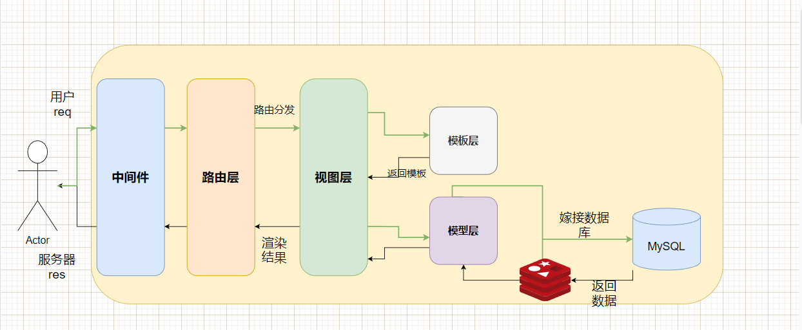

请求的流程如下所示

1. 客户端发送HTTP请求至Django服务器。
2. Django服务器接收到请求并解析请求。它会根据请求的URL匹配相应的URL模式，找到对应的视图函数来处理请求。
3. 在视图函数中，Django可以进行一系列操作，包括从Redis缓存中获取数据、从MySQL数据库中获取数据、对数据进行处理等。
4. 如果需要获取数据，Django会首先检查缓存中是否存在相应的数据。如果存在，Django直接从缓存中读取数据，并生成响应。
5. 如果Redis缓存中不存在所需的数据，Django会执行与MySQL数据库的交互操作。它会使用ORM（对象关系映射）工具，例如Django自带的ORM，将数据库操作转化为Python对象的操作。在这个过程中，Django会根据模型定义和查询条件生成相应的SQL语句，并与MySQL数据库建立连接。
6. 对于MySQL数据库，Django会使用适配器连接到数据库，并执行相应的SQL查询语句。查询结果将以对象的形式返回给视图函数。
7. 在视图函数中，可以对查询结果进行处理、筛选、排序等操作，然后根据业务需求生成响应数据。生成响应时，可以选择返回HTML页面、JSON数据、重定向等不同的响应类型。
8. 同时，Django还可以将查询结果存储到Redis缓存中，以便下次相同请求时可以直接从缓存中读取数据，提高响应速度。
9. 最后，Django服务器将生成的响应发送回客户端，完成请求-响应的过程。

## 2. 项目搭建


```shell
# 创建一个Django项目，命名位course
django-admin startproject course
# 创建一个用户服务应用 
 python manage.py startapp userInfo
```

### 2.1. 基础配置

#### 1. 项目配置

​		为了在我们的工程中包含这个应用，我们需要在配置类 `INSTALLED_APPS`中添加设置。因为 `UserInfoConfig` 类写在文件 `UserInfo/apps.py` 中，所以它的点式路径是 `'userInfo.apps.UserInfoConfig'`。在文件 `course/settings.py` 中 `INSTALLED_APPS`子项添加点式路径后，它看起来像这样：

```cfg

INSTALLED_APPS = [
    'django.contrib.admin',
    'django.contrib.auth',
    'django.contrib.contenttypes',
    'django.contrib.sessions',
    'django.contrib.messages',
    'django.contrib.staticfiles',
    'userInfo.apps.UserinfoConfig'
]

```

#### 2. 数据库配置(MySQL)

```shell
DATABASES = {
    "default": {
        "ENGINE": "django.db.backends.mysql",
        "NAME": "python",
        "USER": "user",
        "PASSWORD": "***********",
        "HOST": "xxxxxxxxxx",
        "PORT": "3306",
    }
}
```

#### 3. 邮件模块配置(163)

```shell
EMAIL_BACKEND = 'django.core.mail.backends.smtp.EmailBackend'
EMAIL_HOST = 'smtp.163.com'
EMAIL_USE_TLS = True
EMAIL_USE_SSL = False
EMAIL_PORT = 25
# 邮箱配置
EMAIL_HOST_USER = '18091323970@163.com'  # 配置邮箱
EMAIL_HOST_PASSWORD = 'xxxxxxxxxxxxxxx'  # 对应的授权码
```

#### 4. Redis 配置

```shell
def get_redis_connection():
    redis_host = 'localhost'
    redis_port = 6379
    redis_password= ""
    redis_db = 0
    redis_client = redis.Redis(host=redis_host, port=redis_port,password=redis_password, db=redis_db)
    return redis_client
```

#### 5. 静态资源配置

```shell
STATIC_URL = '/static/'
```

#### 6. 访问权限配置

```shell
ALLOWED_HOSTS = ['*']
```

### 2.2. 模型迁移

```shell
# 模型激活
$python manage.py makemigrations userInfo
# 输出
Migrations for 'userInfo':
  userInfo\migrations\0001_initial.py
    - Create model UserInfo
```

```shell
# 将结果迁移到数据库中去
python manage.py migrate
```

### 2.3. 开启超级用户模式
```shell
$python manage.py createsuperuser
```

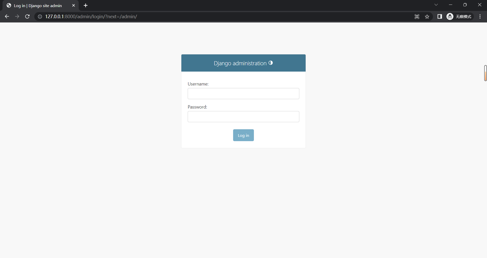

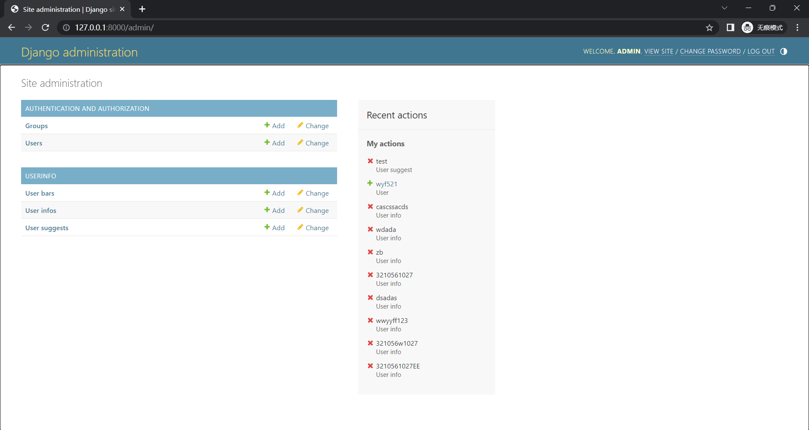

### 2.4. 目录结构

```shell
[root@localhost ~]# tree pycoursedesigin/
pycoursedesigin/
├── course
│   ├── asgi.py
│   ├── __init__.py
│   ├── settings.py
│   ├── urls.py
│   └── wsgi.py
├── images
│   ├── 1-admin.png
│   ├── 1-enteradmin.png
│   ├── 2-code.png
│   ├── 2-redis.png
│   ├── 2-sendemail-test.png
│   ├── 3-register-fail.png
│   ├── 3-register.png
│   ├── 3-register-successfully.png
│   ├── 4-login2.png
│   ├── 4-logins.png
│   ├── 5-modify.png
│   ├── 6-reset.png
│   ├── 7-su.png
│   ├── 8-bars1.png
│   ├── 8-bars2.png
│   ├── context-register.png
│   ├── database-userInfo.png
│   ├── login-fail.png
│   ├── login-successfully.png
│   ├── slide1.png
│   ├── slide1.psd
│   ├── slide2.png
│   ├── slide2.psd
│   ├── slide3.png
│   └── slide3.psd
├── manage.py
├── MobaXterm_centos7-2_20230705_153636.rtf
├── README.md
├── requirements.txt
├── templates
│   ├── bars.html
│   ├── base.html
│   ├── contact.html
│   ├── detail.html
│   ├── home.html
│   ├── index.html
│   ├── information.html
│   ├── login.html
│   ├── modify_password.html
│   ├── register.html
│   ├── rest_password.html
│   └── usage.html
└── userInfo
    ├── admin.py
    ├── apps.py
    ├── detail.py
    ├── function.py
    ├── __init__.py
    ├── login.py
    ├── migrations
    │   ├── 0001_initial.py
    │   ├── 0002_alter_userinfo_email_alter_userinfo_username.py
    │   ├── 0003_alter_userinfo_username.py
    │   ├── 0004_alter_userinfo_email.py
    │   ├── 0005_usersuggest.py
    │   ├── 0006_userbar.py
    │   ├── 0007_alter_userbar_username.py
    │   ├── 0008_rename_bars_userbar_bar.py
    │   └── __init__.py
    ├── models.py
    ├── modify_password.py
    ├── register.py
    ├── reset_password.py
    ├── static
    │   ├── bootstrap
    │   │   ├── css
    │   │   │   ├── bootstrap.css
    │   │   │   ├── bootstrap.css.map
    │   │   │   ├── bootstrap-grid.css
    │   │   │   ├── bootstrap-grid.css.map
    │   │   │   ├── bootstrap-grid.min.css
    │   │   │   ├── bootstrap-grid.min.css.map
    │   │   │   ├── bootstrap-grid.rtl.css
    │   │   │   ├── bootstrap-grid.rtl.css.map
    │   │   │   ├── bootstrap-grid.rtl.min.css
    │   │   │   ├── bootstrap-grid.rtl.min.css.map
    │   │   │   ├── bootstrap.min.css
    │   │   │   ├── bootstrap.min.css.map
    │   │   │   ├── bootstrap-reboot.css
    │   │   │   ├── bootstrap-reboot.css.map
    │   │   │   ├── bootstrap-reboot.min.css
    │   │   │   ├── bootstrap-reboot.min.css.map
    │   │   │   ├── bootstrap-reboot.rtl.css
    │   │   │   ├── bootstrap-reboot.rtl.css.map
    │   │   │   ├── bootstrap-reboot.rtl.min.css
    │   │   │   ├── bootstrap-reboot.rtl.min.css.map
    │   │   │   ├── bootstrap.rtl.css
    │   │   │   ├── bootstrap.rtl.css.map
    │   │   │   ├── bootstrap.rtl.min.css
    │   │   │   ├── bootstrap.rtl.min.css.map
    │   │   │   ├── bootstrap-utilities.css
    │   │   │   ├── bootstrap-utilities.css.map
    │   │   │   ├── bootstrap-utilities.min.css
    │   │   │   ├── bootstrap-utilities.min.css.map
    │   │   │   ├── bootstrap-utilities.rtl.css
    │   │   │   ├── bootstrap-utilities.rtl.css.map
    │   │   │   ├── bootstrap-utilities.rtl.min.css
    │   │   │   └── bootstrap-utilities.rtl.min.css.map
    │   │   └── js
    │   │       ├── bootstrap.bundle.js
    │   │       ├── bootstrap.bundle.js.map
    │   │       ├── bootstrap.bundle.min.js
    │   │       ├── bootstrap.bundle.min.js.map
    │   │       ├── bootstrap.esm.js
    │   │       ├── bootstrap.esm.js.map
    │   │       ├── bootstrap.esm.min.js
    │   │       ├── bootstrap.esm.min.js.map
    │   │       ├── bootstrap.js
    │   │       ├── bootstrap.js.map
    │   │       ├── bootstrap.min.js
    │   │       └── bootstrap.min.js.map
    │   ├── css
    │   │   ├── index.css
    │   │   ├── md.css
    │   │   ├── reset.css
    │   │   └── style.css
    │   ├── detail.html
    │   ├── images
    │   │   ├── 1-NAT\346\246\202\350\277\260.png
    │   │   ├── 1.png
    │   │   ├── 2.png
    │   │   ├── 3.png
    │   │   ├── LOGO.svg
    │   │   ├── person-circle.svg
    │   │   ├── slide1.png
    │   │   ├── slide2.png
    │   │   └── slide3.png
    │   ├── js
    │   │   ├── index.js
    │   │   ├── jquery.js
    │   │   └── register.js
    │   └── soft
    │       ├── client.png
    │       └── server.png
    ├── templatetags
    │   ├── custom_filters.py
    │   └── __init__.py
    ├── tests.py
    ├── urls.py
    ├── user_suggest.py
    └── views.py


```

### 2.5. 项目包版本

```shell
asgiref==3.7.2
async-timeout==4.0.2
backports.zoneinfo==0.2.1
cffi==1.15.1
cryptography==41.0.1
Django==4.2.2
itsdangerous==2.1.2
mysqlclient==2.2.0
pycparser==2.21
pyOpenSSL==23.2.0
redis==4.6.0
sqlparse==0.4.4
typing_extensions==4.6.3
tzdata==2023.3
```


## 3. 用户模型

### 3.1. 模型介绍

用户信息模型目前有以下五个内容：`user_id`,`username`,`password`,`email`,`flag`,`time`

-`user_id`：由数据库自动制定
-`username`：用户名
-`password`：用户密码
-`email`：用户邮箱
-`flag`：是否删除标志，默认为`false`
-`time`：用户账户过期时间

```python
class UserInfo(models.Model):
    user_id = models.AutoField(primary_key=True)
    username = models.CharField(max_length=255,unique=True)
    password = models.CharField(max_length=255)
    email = models.EmailField(unique=True)
    flag = models.BooleanField(default=False)
    time = models.DateTimeField(null=True)

    def __str__(self):
        return self.username
```

- `user_id` 字段使用了 `AutoField`，它是一个自动递增的整数字段，作为主键。
- `username` 字段使用了 `CharField`，它表示一个字符型字段，最大长度为 255。
- `password` 字段使用了 `CharField`，表示用户密码字段，最大长度为 255。
- `email` 字段使用了 `EmailField`，表示用户邮箱字段，验证输入的值是否为有效的邮箱格式。
- `flag` 字段使用了 `BooleanField`，表示一个布尔类型字段，默认值为 `False`，表示未删除状态。
- `time` 字段使用了 `DateTimeField`，表示一个日期时间类型字段，允许为 `null` 值，用于表示用户账户的过期时间。

```shell
# 模型激活
$ python manage.py makemigrations userInfo
# 输出
Migrations for 'userInfo':
  userInfo\migrations\0001_initial.py
    - Create model UserInfo

```

​		通过运行 `makemigrations` 命令，Django 会检测你对模型文件的修改（在这种情况下，你已经取得了新的），并且把修改的部分储存为一次*迁移*。

```shell
# 可视化迁移结果
$ python manage.py sqlmigrate userInfo 0001
```

```mysql

BEGIN;
--
-- Create model UserInfo
--
CREATE TABLE "userInfo_userinfo" ("user_id" integer NOT NULL PRIMARY KEY AUTOINCREMENT, "username" varchar(255) NOT NULL, "password" varchar(255) NOT NULL, "email" varchar(254) NOT NULL, "flag" bool NOT NULL, "time" datetime NULL);
COMMIT;

```

```shell
# 将结果迁移到数据库中去
python manage.py migrate
```

### 3.2. 发送邮件功能

#### 1. view

```python
def send_email_verification(request):
    if request.method == "POST":
        email = request.POST.get("email")  # 获取前端传递的邮箱地址
        subject = 'NAT验证码'
        message = generate_verification_code()
        store_verification_code(email, message)
        from_email = '18091323970@163.com'
        # 执行发送邮箱验证码的逻辑
        send_mail(subject, message, from_email, [email])
        return JsonResponse({"message": "邮箱验证码发送成功", "success": True})
    else:
        return JsonResponse({"message": "请求方法不支持", "success": False})
```

这段代码是一个`Django`视图函数，用于处理发送邮件验证码的请求。它包含这样的逻辑：

1. 首先，它检查请求的方法是否为POST，如果不是，则返回一个JSON响应表示请求方法不支持。
2. 如果请求方法为POST，它从请求的POST数据中获取邮箱地址，并调用`generate_verification_code`生成一个验证码。
3. 然后，它调用`store_verification_code`函数将邮箱地址和验证码存储到`Redis`中。
4. 接下来，它设置了邮件的主题和消息内容。
5. 然后，它指定了发送方的邮箱地址。
6. 最后，它调用`send_mail`函数发送邮件，将主题、消息、发送方邮箱和接收方邮箱作为参数。
7. 如果发送邮件成功，它返回一个JSON响应表示邮件验证码发送成功。

#### 2. urls

```python
 path('send-email-verification/', views.send_email_verification, name='send_email_verification')
```

#### 3. 函数说明

**随机生成验证码函数:**

```python	
def generate_verification_code(length=6):
    characters = string.digits  # 仅包含数字的字符集
    code = ''.join(random.choice(characters) for _ in range(length))
    return code
```

**存储到Redis函数:**

```python
def store_verification_code(email, code, expire_time=300):
    redis_client = get_redis_connection()
    redis_key = email
    redis_client.set(redis_key, code, ex=expire_time)
```

#### 4. 功能测试

```js
$(document).ready(function () {
            $("#sendButton").click(function () {
                startCountdown()
                let csrftoken = getCookie('csrftoken');
                $.ajax({
                    url: "",  // Django后端的URL
                    method: "POST",
                    headers: {"X-CSRFToken": csrftoken},  // 在请求头中包含CSRF令牌
                    data: {email: document.getElementById("email").value},  // 将邮箱地址作为数据发送
                    success: function (response) {
                        alert(response.message);  // 弹出成功信息
                    },
                    error: function () {
                        alert("发送邮件失败");  // 弹出错误信息
                    }
                });
            })
})
```

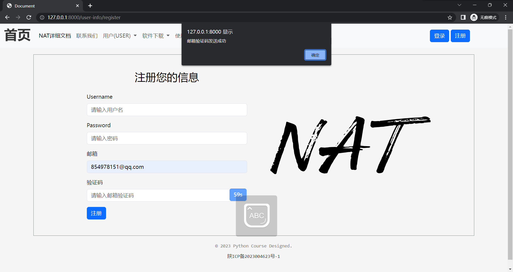

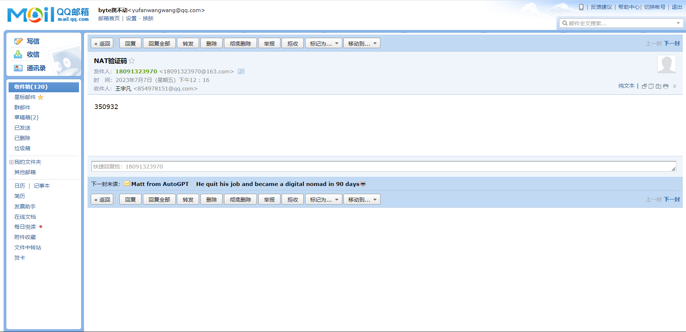

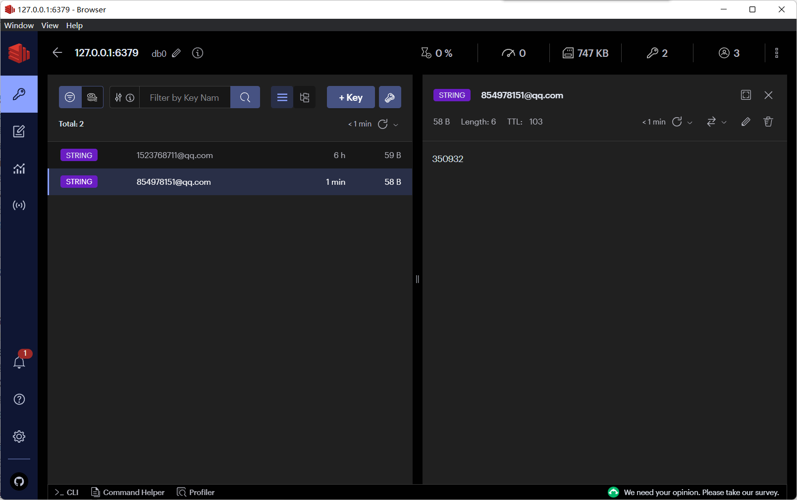

当我们执行发送邮件的功能时，发现邮箱正确的收到了邮件，且将`email`作为`key`,`code`作为`value`存入到了`redis`数据库中去了.

### 3.3. 用户注册功能

#### 1. 模型建立

**Django 提供了一个辅助类让你可以从一个 Django 模型创建一个 Form 类。**

于是我们创建了名称为`UserRegistrationForm`的 Form类如下所示：
```python
class UserRegistrationForm(forms.ModelForm):
    username = forms.CharField(max_length=255)
    password = forms.CharField(max_length=255)
	email = forms.EmailField()

class Meta:
    model = UserInfo
    fields = ['username', 'password', 'email']
```

**Meta类用于提供额外的元数据（metadata），以指定表单的行为和特性。**Meta类被用于定义`UserInfoForm`表单类的元数据。其中，model属性指定了与表单相关联的模型，这里是`UserInfo`模型。这意味着该表单将用于创建和更新`UserInfo`模型的实例。`fields`属性指定了要在表单中显示的字段列表。表单将显示`username`、`password`和`email`字段，用户可以填写这些字段的值。这些字段与`UserInfo`模型中的对应字段相关联。

#### 2.  定义校验规则

查找`Django`官方文档我们了解到`clean_filename` 方法是在表单子类上调用的—其中`filename`被替换为表单字段属性的名称。这个方法做任何特定属性的清理工作，与字段的类型无关。这个方法不传递任何参数。你需要在 self.cleaned_data 中查找字段的值，并且记住，此时它将是一个 Python 对象，而不是在表单中提交的原始字符串（它将在 cleaned_data 中，因为上面的一般字段 clean() 方法已经清理了一次数据）


于是我们对`username`、`password`、`email`制定相应的校验规则，添加到`UserRegistrationForm`类中去：

```python

    def clean_username(self):
        username = self.cleaned_data.get('username')
        # 自定义校验规则
        if len(username) < 5:
            raise forms.ValidationError("用户名长度不能少于5个字符")
        return username

    def clean_password(self):
        password = self.cleaned_data.get('password')
        # 自定义校验规则
        if len(password) < 8:
            raise forms.ValidationError("密码长度不能少于8个字符")
        return password

    def clean(self):
        cleaned_data = super().clean()
        username = cleaned_data.get('username')
        password = cleaned_data.get('password')
        email = cleaned_data.get('email')

        if username and password and email:
            try:
                user_with_username = UserInfo.objects.get(username=username)
                raise forms.ValidationError('Username already exists.')
            except UserInfo.DoesNotExist:
                pass

            try:
                user_with_email = UserInfo.objects.get(email=email)
                raise forms.ValidationError('Email already exists.')
            except UserInfo.DoesNotExist:
                pass

        return cleaned_data
```


#### 3. view建立

```python
def register(request):
    if request.method == 'POST':
        form = UserRegistrationForm(request.POST)
        email = form.data.get("email")
        code = form.data.get("emailcode")
        if not check_verification_code(email, code):
            return JsonResponse({'success': False, 'errors': "验证码错误"})  # 返回失败的 JSON 响应和表单错误信息
        if form.is_valid():
            form.save()
            return JsonResponse({'success': True})  # 返回成功的 JSON 响应
        else:
            return JsonResponse({'success': False, 'errors': form.errors})  # 返回失败的 JSON 响应和表单错误信息
    else:
        form = UserRegistrationForm()

    return render(request, 'register.html', {'form': form})
```

**前端模板测试**

```html

    <h2>注册您的信息</h2>
    <form method="post" id="registration-form">
        
        <div class="mb-3">
            <label for="username" class="form-label">Username</label>
            <input type="text" class="form-control" id="username" name="username" placeholder="请输入用户名">
        </div>
        <div class="mb-3">
            <label for="password" class="form-label">Password</label>
            <input type="password" class="form-control" id="password" name="password" placeholder="请输入密码">
        </div>
        <div class="mb-3">
            <label for="email" class="form-label">邮箱</label>
            <input type="text" class="form-control" id="email" placeholder="请输入您的邮箱" name="email">
        </div>
        <div class="mb-3">
            <label for="emailcode" class="form-label">验证码</label>
            <input type="text" class="form-control" id="emailcode" placeholder="请输入邮箱验证码" name="emailcode">
            <button type="button" class="btn btn-primary" id="sendButton">发送</button>
        </div>
        <button type="submit" class="btn btn-primary">注册</button>
    </form>


{% endblock %
```

``：这是Django模板标签，用于生成和包含CSRF令牌。CSRF令牌用于防止跨站请求伪造攻击。

`注意：本次前端采用的说Bootstrap5`

#### 4. 路由注册

```python
path('user-info/register', views.register, name='register'),
```


#### 5. 功能测试

1. **界面展示**

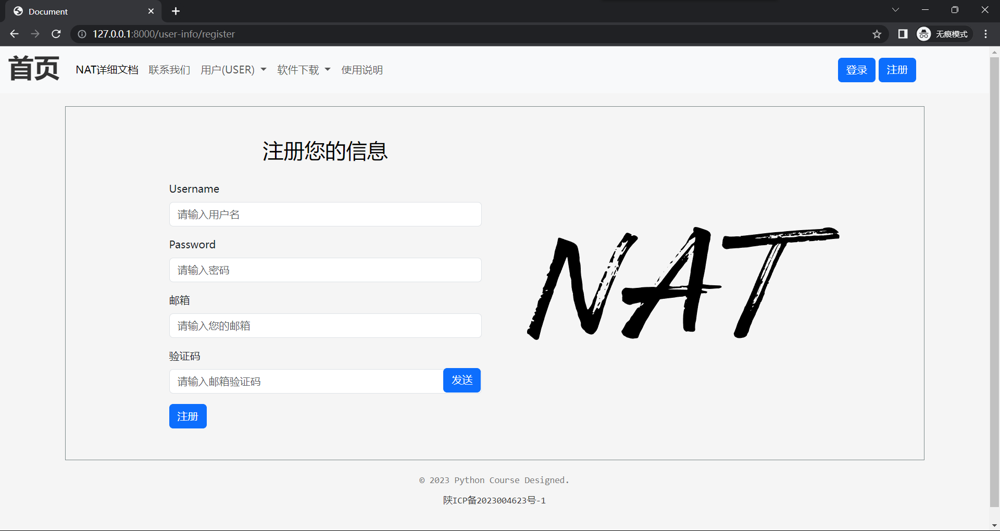

2. **注册成功**

- `username`:`3210561027`
- `password`:`3210561027`
- `email`:`854978151@qq.com`

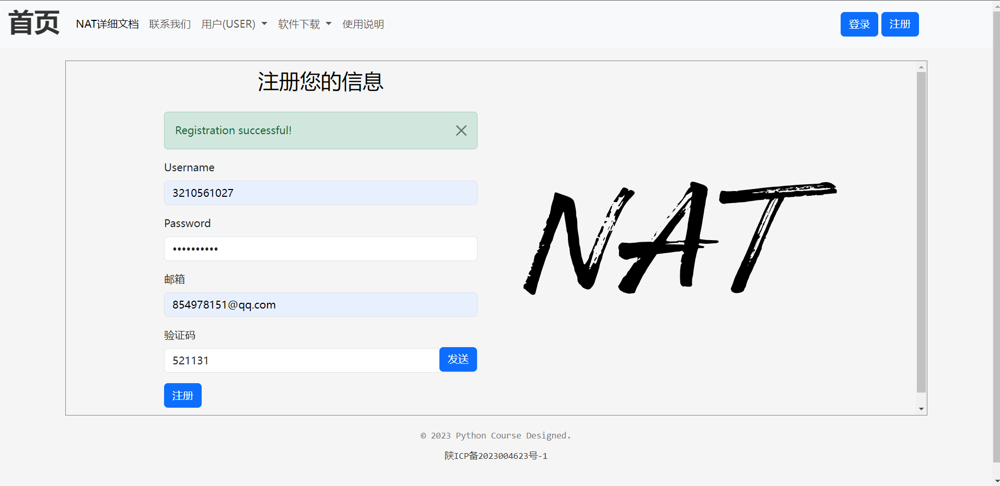


3. **注册失败**

再次使用上面相同的用户名

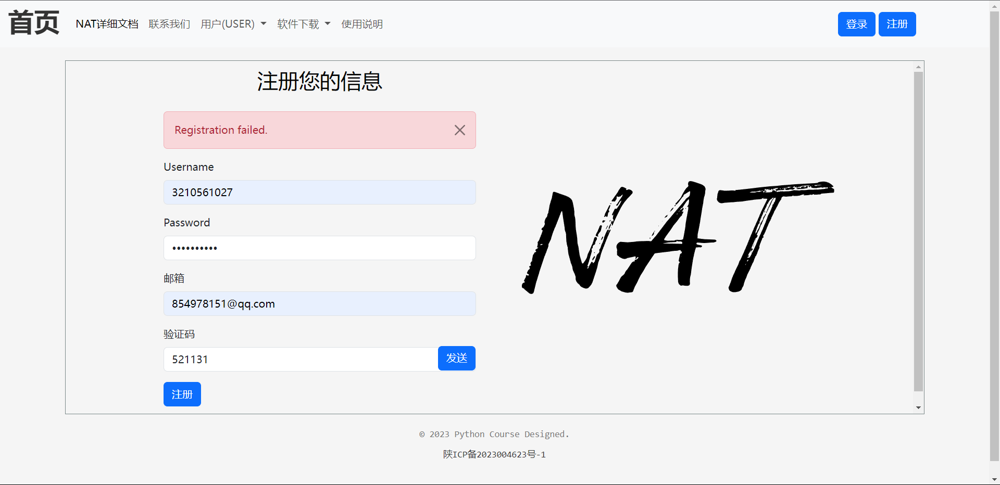


### 3.4. 用户登录功能

#### 1. 模型建立

和注册模块相同，我们也同样创建了一个`login-form`的模板，代码如下所示:

```python
class UserLoginForm(forms.ModelForm):
    username = forms.CharField(max_length=255)
    password = forms.CharField(max_length=255)
    
     class Meta:
        model = UserInfo
        fields = ['username', 'password']
```

#### 2. 定义校验规则

```python
    def clean_username(self):
        username = self.cleaned_data.get('username')
        # 自定义校验规则
        if len(username) < 5:
            raise forms.ValidationError("用户名长度不能少于5个字符")
        return username

    def clean_password(self):
        password = self.cleaned_data.get('password')
        # 自定义校验规则
        if len(password) < 8:
            raise forms.ValidationError("密码长度不能少于8个字符")
        return password

    def clean(self):
        cleaned_data = super().clean()
        username = cleaned_data.get('username')
        password = cleaned_data.get('password')

        if username and password:

            try:
                user = UserInfo.objects.get(username=username)
                if user.username == "" or user.password != password:
                    raise forms.ValidationError('Invalid username or password.')
                cleaned_data['user_id']=user.user_id
            except UserInfo.DoesNotExist:
                raise forms.ValidationError('Invalid username or password.')
        return cleaned_data

```

1. 首先，`clean`调用父类的`clean`方法，以获取经过默认验证的表单数据。

2. 然后，它从清理后的数据中获取`username`和`password`的值。

3. 如果`username`和`password`都存在，它执行以下验证逻辑：

   - 首先，它尝试通过`UserInfo.objects.get(username=username)`查询数据库获取与输入的`username`相匹配的用户对象。

   - 如果查询到了用户对象，它会进一步检查以下条件：

     - 用户名为空字符串 (`user.username == ""`)，或者
     - 密码不匹配 (`user.password != password`)。

     如果任何一个条件不满足，它会抛出一个`forms.ValidationError`异常，提示用户名或密码无效。否则，它将用户对象的`user_id`值存储到清理后的数据中(`cleaned_data['user_id']`)。

4. 如果查询数据库时捕获到`UserInfo.DoesNotExist`异常，它会抛出一个`forms.ValidationError`异常，提示用户名或密码无效。

5. 最后，它返回清理后的数据`cleaned_data`。

该`clean`方法的目的是在验证表单数据时，检查用户名和密码的有效性，并将验证通过的用户ID存储到清理后的数据中。

#### 3. view建立

```python	
def login_view(request):
    if request.method == 'POST':
        form = UserLoginForm(request.POST)
        if form.is_valid():
            user_id = form.cleaned_data.get('user_id')
            user_name = form.cleaned_data.get('username')
            token = serializer.dumps({'user_id': user_id, 'username': user_name})
            return JsonResponse({'success': True, 'token': token})
        else:
            errors = form.errors.as_json()
            return JsonResponse({'success': False, 'errors': errors})
    else:
        form = UserLoginForm()

    return render(request, 'login.html', {'form': form}
```

1. 首先，检查请求的方法是否为POST。如果是POST请求，表示用户提交了登录表单。
2. 创建一个`UserLoginForm`实例，使用请求中的POST数据初始化表单。
3. 调用`is_valid()`方法验证表单数据。如果表单数据有效，则执行以下操作：
   - 从清理后的数据中获取`user_id`和`username`的值。
   - 使用`serializer`对用户ID和用户名进行序列化，生成一个令牌(token)。
   - 返回一个JSON响应，包含登录成功的标志(`success=True`)和生成的令牌(`token`)。
4. 如果表单数据无效，则执行以下操作：
   - 使用`errors.as_json()`方法将表单的错误信息转换为JSON格式。
   - 返回一个JSON响应，包含登录失败的标志(`success=False`)和表单的错误信息(`errors`)。
5. 如果请求的方法不是POST，表示是首次加载登录页面，创建一个`UserLoginForm`实例。
6. 渲染登录页面模板`login.html`，将表单实例传递给模板，以便在页面中显示表单。

**登录模板**

```html	
 <form method="post" id="login-form">
        
        <div class="mb-3">
            <label for="username" class="form-label">Username</label>
            <input type="text" class="form-control" id="username" name="username" placeholder="请输入用户名">
        </div>
        <div class="mb-3">
            <label for="password" class="form-label">Password</label>
            <input type="password" class="form-control" id="password" name="password" placeholder="请输入密码">
        </div>
        <button type="submit" class="btn btn-primary">登录</button>
    </form>
```


#### 4. 路由注册

```python
  path('user-info/login', views.login_view, name='login'),
```

#### 5. 功能测试

```js
 $('#login-form').submit(function (event) {
                event.preventDefault(); // 阻止表单默认提交
                // 发起 Ajax 请求
                $.ajax({
                    url: '',  // 登录处理视图的 URL
                    type: 'POST',
                    data: $(this).serialize(),  // 序列化表单数据
                    success: function (response) {
                        if (response.success) {
                            // 登录成功
                            let user = {
                                username: $("#username").val(),
                                token:response.token
                            };
                            localStorage.setItem('user', JSON.stringify(user));
                            // 调用修改函数


                            showAlert('success', 'Login successful!' + '  1.5s后跳转到主页');
                            {#$(' #login-form').hide()#}
                            // 延时 3 秒后执行回调函数
                            setTimeout(function () {
                                window.location.href = '';  // 重定向到成功页面
                            }, 1500);  // 延时时间为 3000 毫秒，即 3 秒
                        } else {
                            // 登录失败
                            showAlert('danger', 'Login failed. Please check your credentials.');
                        }
                    },
                    error: function (response) {
                        showAlert('danger', 'An error occurred during login.');  // 处理请求错误
                    }
                });
            });
```


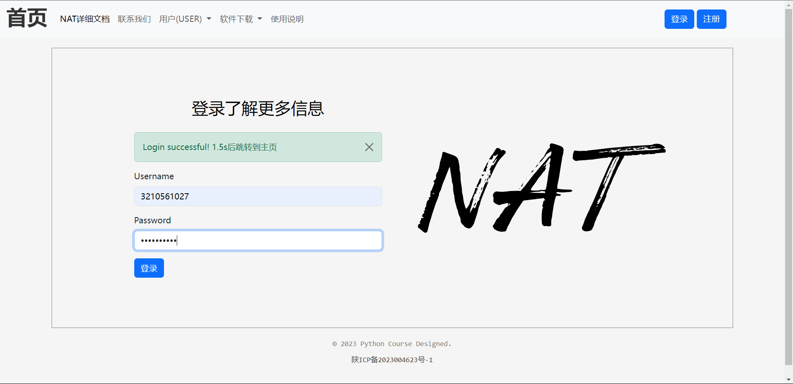

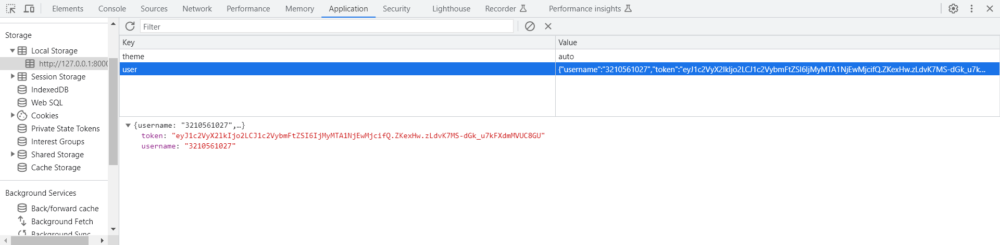

当我们登录成功的时候，发现服务端正确的返回了token值，且存储到浏览器的缓存中去。

### 3.5. 用户修改密码

#### 1. 模型建立

```python
class ModifyUserPassword(forms.ModelForm):
    username = forms.CharField()
    old_password = forms.CharField(max_length=255)
    password = forms.CharField(max_length=255)
    confirm_password = forms.CharField(max_length=255)
    
        class Meta:
        model = UserInfo
        fields = ['username', 'password']
```

#### 2. 定义校验规则

```python
    def clean_username(self):
        username = self.cleaned_data.get('username')
        # 自定义校验规则
        if len(username) < 5:
            raise forms.ValidationError("用户名长度不能少于5个字符")
        return username

    def clean_old_password(self):
        old_password = self.cleaned_data.get('old_password')
        # 自定义校验规则
        if len(old_password) < 8:
            raise forms.ValidationError("密码长度不能少于8个字符")
        return old_password

    def clean_password(self):
        password = self.cleaned_data.get('password')
        # 自定义校验规则
        if len(password) < 8:
            raise forms.ValidationError("密码长度不能少于8个字符")
        return password

    def clean_confirm_password(self):
        confirm_password = self.cleaned_data.get('confirm_password')
        # 自定义校验规则
        if len(confirm_password) < 8:
            raise forms.ValidationError("密码长度不能少于8个字符")
        return confirm_password

    def clean(self):
        username = self.cleaned_data.get("username")
        old_password = self.cleaned_data.get('old_password')
        password = self.cleaned_data.get('password')
        confirm_password = self.cleaned_data.get('confirm_password')
        print(username, old_password, password, confirm_password)
        if password != confirm_password:
            raise forms.ValidationError("两次密码不匹配")

        if username and old_password and password:
            try:
                user = UserInfo.objects.get(username=username)
                print(user.username,user.password,old_password)
                if user.username != username:
                    raise forms.ValidationError("用户不能存，不能修改")
                if user.password != old_password:
                    raise forms.ValidationError("原密码错误")
                print(user.password)
                UserInfo.objects.filter(username=username).update(password=password)
            except UserInfo.DoesNotExist:
                raise forms.ValidationError("用户不存在，不能修改")
```

1. 首先，从`cleaned_data`属性中获取表单字段的值，包括`username`、`old_password`、`password`和`confirm_password`。
2. 检查`password`和`confirm_password`是否相等，如果不相等，则抛出`forms.ValidationError`异常，提示两次密码不匹配。
3. 如果`username`、`old_password`和`password`都有值，执行以下操作：
   - 尝试根据`username`获取`UserInfo`对象。
   - 检查获取到的用户对象的`username`和`old_password`是否与表单字段的值匹配，如果不匹配，则抛出`forms.ValidationError`异常，提示用户不能存，不能修改。
   - 检查获取到的用户对象的`password`是否与`old_password`匹配，如果不匹配，则抛出`forms.ValidationError`异常，提示原密码错误。
   - 更新用户对象的`password`字段为新的`password`值。
4. 如果根据`username`未找到对应的`UserInfo`对象，抛出`forms.ValidationError`异常，提示用户不存在，不能修改。

#### 3. view建立

```python
def modifyPassword(request, username):
    if request.method == 'POST':
        form = ModifyUserPassword(request.POST)
        if form.is_valid():
            return JsonResponse({'success': True})
        else:
            errors = form.errors.as_json()
            print(errors)
            return JsonResponse({'success': False, 'errors': errors})
    else:
        form = ModifyUserPassword()
    return render(request, 'modify_password.html', {'form': form}
```

当请求方法为POST时，表示用户提交了修改密码的表单。我们创建一个`ModifyUserPassword`表单实例，将用户提交的数据传递给表单进行验证。如果表单数据有效，则返回一个包含成功状态的JSON响应；否则，返回一个包含错误信息的JSON响应。当请求方法为GET时，表示用户访问了修改密码的页面。我们创建一个空的`ModifyUserPassword`表单实例，将其传递给模板进行渲染，并返回渲染后的页面。无论是POST请求还是GET请求，都会使用`render`函数将相应的模板渲染成HTML页面，将表单实例传递给模板。

**修改模板**

```html

    <form method="post" id="modify-password-form">
        
        <div class="mb-3">
            <input type="hidden" class="form-control" id="username" name="username" placeholder="请输入用户名" >
        </div>
        <div class="mb-3">
            <label for="old_password" class="form-label">old_password</label>
            <input type="password" class="form-control" id="old_password" name="old_password" placeholder="请输入旧的密码">
        </div>
        <div class="mb-3">
            <label for="password" class="form-label">Password</label>
            <input type="password" class="form-control" id="password" name="password" placeholder="请输入新的密码">
        </div>
        <div class="mb-3">
            <label for="confirm_password" class="form-label">confirm_Password</label>
            <input type="password" class="form-control" id="confirm_password" name="confirm_password" placeholder="请确认新的密码">
        </div>
        <button type="submit" class="btn btn-primary">提交修改</button>
    </form>
{% endblock %
```

#### 4. 路由注册

```python
    path('modify-password', views.modifyPassword, name='modify-password'),
```

#### 5. 功能测试

**将用户`3210561027`的密码修改为`12345678`**

**修改前**

```shell
mysql> select password from userInfo_userinfo where username='3210561027';
+------------+
| password   |
+------------+
| 3210561027 |
+------------+
1 row in set (0.09 sec)
```

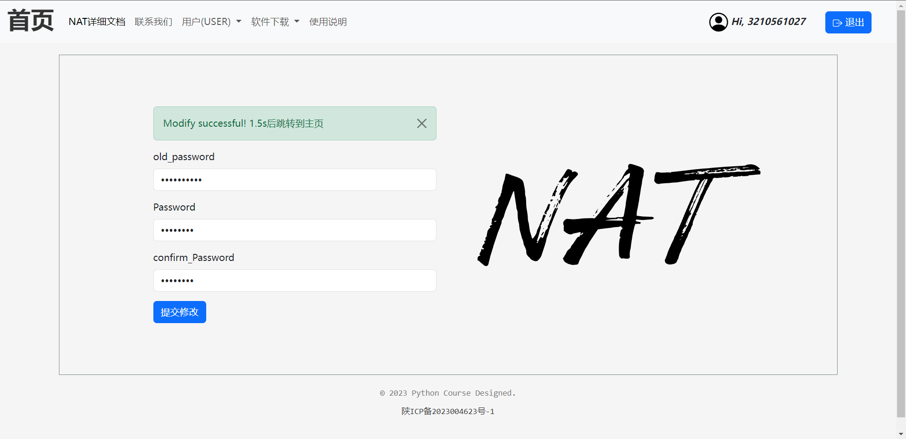

**修改后**

```shell
mysql> select password from userInfo_userinfo where username='3210561027';
+----------+
| password |
+----------+
| 12345678 |
+----------+
1 row in set (0.10 sec)
```

进行密码修改之前，我们可以看到`3210561027`用户的密码为`3210561027`,修改之后我们再次查询该用户，发现密码已经成功的修改了。且浏览器给我们了具体的响应。

#### 3.6. 用户重置密码

#### 1. 模型建立

```python
class ResetPassword(forms.ModelForm):
    username = forms.CharField(max_length=255)
    email = forms.CharField(max_length=255)
    code = forms.CharField(max_length=255)
    password = forms.CharField(max_length=255)
    confirm_password = forms.CharField(max_length=255)
    
    class Meta:
        model = UserInfo
        fields = ['username', 'password']
```

- - `username`：字符型字段，用于输入用户名，最大长度为255个字符。
  - `email`：字符型字段，用于输入邮箱地址，最大长度为255个字符。
  - `code`：字符型字段，用于输入验证码，最大长度为255个字符。
  - `password`：字符型字段，用于输入新密码，最大长度为255个字符。
  - `confirm_password`：字符型字段，用于再次输入新密码进行确认，最大长度为255个字符。
- `Meta`内部类指定了该表单所基于的模型类为`UserInfo`，并指定了需要包含的字段为`username`和`password`。

#### 2. 定义校验规则

**该规则同上，不在赘述**

```python
  def clean(self):
        username = self.cleaned_data.get("username")
        password = self.cleaned_data.get('password')
        email = self.cleaned_data.get('email')
        code = self.cleaned_data.get('code')
        confirm_password = self.cleaned_data.get('confirm_password')

        if password != confirm_password:
            raise forms.ValidationError("两次密码不匹配")
        if username and password:
            try:
                user = UserInfo.objects.get(username=username)
                if not check_verification_code(user.email, code):
                    raise forms.ValidationError("验证码错误")
                if user.username != username:
                    raise forms.ValidationError("用户不能存，不能修改")
                UserInfo.objects.filter(username=username).update(password=password)
            except UserInfo.DoesNotExist:
                raise forms.ValidationError("用户不存在，不能修改")
```

- 在`clean`方法中，首先通过`self.cleaned_data.get()`方法获取表单字段的值，包括`username`、`password`、`email`、`code`和`confirm_password`。
- 然后进行一系列的验证逻辑：
  - 验证密码和确认密码是否匹配，如果不匹配，则抛出`forms.ValidationError`异常，提示密码不匹配。
  - 如果存在用户名和密码，通过`UserInfo.objects.get()`方法尝试获取用户对象。
  - 验证验证码的正确性，使用`check_verification_code`函数来检查验证码是否正确，如果不正确，则抛出`forms.ValidationError`异常，提示验证码错误。
  - 验证用户名的匹配性，如果表单中的用户名和获取到的用户对象的用户名不一致，则抛出`forms.ValidationError`异常，提示用户不能修改。
- 如果在验证过程中捕获到`UserInfo.DoesNotExist`异常，说明用户不存在，抛出`forms.ValidationError`异常，提示用户不存在，不能修改。
- 如果验证通过，使用`UserInfo.objects.filter().update()`方法更新用户对象的密码。

#### 3. view建立

```python
def resetPassword(request):
    if request.method == 'POST':
        form = ResetPassword(request.POST)
        if form.is_valid():
            return JsonResponse({'success': True})
        else:
            errors = form.errors.as_json()
            return JsonResponse({'success': False, 'errors': errors})
    else:
        form = ResetPassword()
    return render(request, 'rest_password.html', {'form': form})
```

当请求方法为POST时，表示用户提交了重置密码的表单。我们创建一个`ResetPassword`表单实例，将用户提交的数据传递给表单进行验证。如果表单数据有效，则返回一个包含成功状态的JSON响应；否则，返回一个包含错误信息的JSON响应。当请求方法为GET时，表示用户访问了重置密码的页面。我们创建一个空的`ResetPassword`表单实例，将其传递给模板进行渲染，并返回渲染后的页面。无论是POST请求还是GET请求，都会使用`render`函数将相应的模板渲染成HTML页面，将表单实例传递给模板。

#### 4. 路由注册

```python
    path('reset-password',views.resetPassword,name='reset-password'),
```

#### 5. 功能测试

**重置之前**

```shell
mysql> select password from userInfo_userinfo where username='3210561027';
+----------+
| password |
+----------+
| 12345678 |
+----------+
1 row in set (0.10 sec)
```

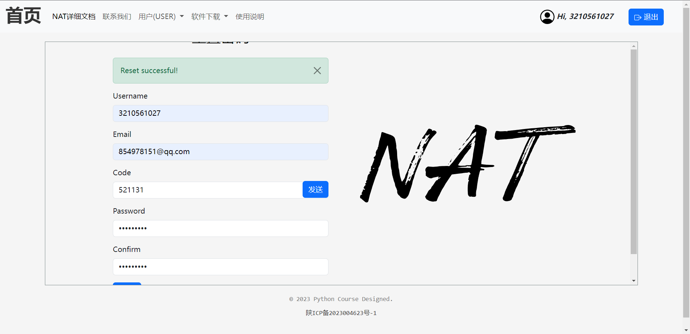

**重置之后**

```python
mysql> select password from userInfo_userinfo where username='3210561027';
+-----------+
| password  |
+-----------+
| 147852369 |
+-----------+
1 row in set (0.11 sec)
```

进行密码重置之前，我们可以看到`3210561027`用户的密码为`12345678`,重置之后我们再次查询该用户，发现密码已经成功的重置了。且浏览器给我们了具体的响应。

### 3.6. 鉴权中间件

我们需要将某些功能对用户进行限制，比如，修改密码必须在登录之后等等，于是我们制作了一个鉴权中间件，保证用户登录的情况下才能使用相关的功能。

```python
def login_required(view_func):
    def wrapper(request, *args, **kwargs):
        token = request.COOKIES.get('token')  # 获取请求中的 token（假设存储在 Cookie 中）

        if not token:
            # 如果没有 token，用户未登录，重定向到登录页面或其他适当的处理方式
            return redirect('login')  # 登录页面的URL名称

        try:
            # 创建反序列化器，使用与生成 token 相同的密钥
            data = serializer.loads(token)  # 解析 token

            user_id = data.get('user_id')
            username = data.get('username')
            if user_id is None or username is None:
                return redirect('login')  # 登录页面的URL名称

            # 将 user_id 和 username 添加到 kwargs 中，传递给视图函数
            # kwargs['user_id'] = user_id
            kwargs['username'] = username

        except BadSignature:
            # token 无效，用户未登录，重定向到登录页面或其他适当的处理方式
            return redirect('login')  # 登录页面的URL名称

        return view_func(request, *args, **kwargs)

    return wrappe
```

- `login_required`是一个装饰器函数，它接受一个视图函数`view_func`作为参数，并返回一个新的包装函数`wrapper`。
- 在`wrapper`函数中，首先尝试从请求的Cookie中获取名为`token`的值，即用户的身份认证令牌。
- 如果没有获取到`token`，说明用户未登录，可以根据具体需求进行处理，例如重定向到登录页面或其他适当的操作。
- 如果成功获取到`token`，则使用与生成令牌时相同的密钥进行反序列化，将令牌解析为原始数据。
- 解析出`user_id`和`username`，如果其中任一值为`None`，说明令牌无效或不完整，可以根据具体需求进行处理，例如重定向到登录页面或其他适当的操作。
- 如果成功解析出`user_id`和`username`，则将它们添加到`kwargs`中，传递给原始的视图函数。
- 如果解析过程中捕获到`BadSignature`异常，说明令牌无效或被篡改，可以根据具体需求进行处理，例如重定向到登录页面或其他适当的操作。
- 最后，返回原始的视图函数`view_func`，并传递请求和其他参数。

当用户没有登陆时，访问相关的服务时，会自动跳转到登录页面，保证了系统的安全性。

## 4. 用户建议模型

### 4.1. 模型介绍

```python
class UserSuggest(models.Model):
    username = models.CharField(max_length=255)
    email = models.CharField(max_length=255)
    subject = models.CharField(max_length=255)
    text = models.TextField()

    def __str__(self):
        return self.subject
```

`UserSuggest`是一个Django模型，用于存储用户建议信息。下面是对该模型的简要介绍：

- `username`是一个字符型字段，用于存储用户的用户名，其最大长度为255个字符。
- `email`是一个字符型字段，用于存储用户的电子邮件地址，其最大长度为255个字符。
- `subject`是一个字符型字段，用于存储建议的主题，其最大长度为255个字符。
- `text`是一个文本型字段，用于存储建议的具体内容。

### 4.2. 建议功能

#### 1. 模型建立

```python
class UserSuggestForm(forms.ModelForm):
    username = forms.CharField(max_length=255)
    email = forms.EmailField(max_length=255)
    subject = forms.CharField(max_length=255)
    text = forms.CharField(widget=forms.Textarea)

    class Meta:
        model = UserSuggest
        fields = ['username', 'email', 'subject', 'text']
```

- `username`：使用`forms.CharField`定义的字符字段，最大长度为255。
- `email`：使用`forms.EmailField`定义的邮箱字段，最大长度为255。
- `subject`：使用`forms.CharField`定义的字符字段，最大长度为255。
- `text`：使用`forms.CharField`定义的文本字段，使用`forms.Textarea`小部件进行渲染。

在`Meta`类中，指定了该表单类与`UserSuggest`模型的关联，指定了需要包含的字段为`username`、`email`、`subject`和`text`。

#### 2. 定义校验规则

```python
 def clean_username(self):
        username = self.cleaned_data.get('username')
        # 自定义校验规则
        if len(username) < 5:
            raise forms.ValidationError("用户名长度不能少于5个字符")
        return username
```

该校验规则与上面的类似，不在进行赘述。

#### 3. view建立

```python
@login_required
def contact(request, username):
    if request.method == 'POST':
        form = UserSuggestForm(request.POST)
        if form.is_valid():
            form.save()
            return JsonResponse({'success': True})  # 重定向到成功页面
        else:
            errors = form.errors.as_json()
            return JsonResponse({'success': False, 'errors': errors})
    else:
        form = UserSuggestForm()
    return render(request, 'contact.html', {'form': form}
```

视图函数`contact`，使用了`@login_required`装饰器来限制只有登录用户才能访问该页面。函数接受`request`和`username`作为参数。如果请求方法是POST，表示用户提交了联系表单的数据。它会对提交的数据进行验证，如果验证通过，则保存表单数据并返回一个成功的JSON响应。如果验证不通过，将返回一个包含错误信息的JSON响应。如果请求方法不是POST，即用户初次访问页面或使用GET请求访问页面，它会创建一个空的`UserSuggestForm`实例，并将其传递给模板进行渲染。最后，通过`render`函数将渲染后的页面作为HTTP响应返回给用户。

#### 4. 路由注册

```python
  path('contact', views.contact, name='contact'),
```

#### 5. 功能测试

**测试之前**

```shell
mysql> select * from userInfo_usersuggest where username='3210561027';
Empty set
```

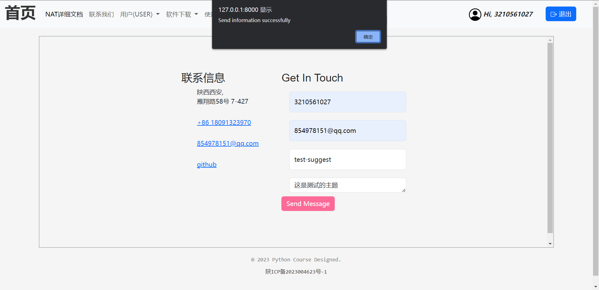

```shell
mysql> select * from userInfo_usersuggest where username='3210561027';
+----+------------+------------------+--------------+----------------+
| id | username   | email            | subject      | text           |
+----+------------+------------------+--------------+----------------+
|  6 | 3210561027 | 854978151@qq.com | test-suggest | 这是测试的主题 |
+----+------------+------------------+--------------+----------------+
1 row in set (0.14 sec)

```

在测试之前，我们通过`SELECT`语句查找`username`为`3210561027`用户的建议信息，我们发现什么都没有，结果为`Empty set`,当我们执行该`url`之后，再次执行查询语句，发现用户的信息正确的插入到数据库中去，且浏览器给出了正确的响应。

## 5. 账单模型

### 5.1. 模型介绍

```python
class UserBar(models.Model):
    username = models.CharField(max_length=255)
    bar = models.BigIntegerField()
    # 添加其他字段...

    class Meta:
        db_table = 'bars'
```

- `username`是一个字符型字段，用于存储用户的用户名，其最大长度为255个字符。
- `bar`是一个大整型字段，用于存储柱用户所使用数据的字节数。

### 5.1. 账单显示功能

#### 1. Django过滤器

```python
# custom_filters.py

from django import template

register = template.Library()


@register.filter
def divide(value, divisor):
    return round(int(value) / divisor, 2)

```

divide`函数接受两个参数：`value`和`divisor`，表示被除数和除数。在函数体内，它执行整数除法运算，并使用`round`函数将结果保留两位小数，最后，函数返回运算结果。

#### 2. Bars 模板

```html



    <table class="table table-info  table-striped table-hover table-bordered">
        <thead>
        <tr>
            <th scope="col">ID</th>
            <th scope="col">Username</th>
            <th scope="col">Bars</th>
        </tr>
        </thead>
        <tbody>
        
            <tr>
                <th scope="row">1</th>
                <td>{{ bar.username }}</td>
                <td>{{ bar.bar|divide:65536 }} MB</td>

            </tr>
        

        </tbody>
    </table>


```

- 在``和``之间的部分定义了一个表格，用于展示用户使用数据量。
- 使用``指令迭代遍历一个名为`bars`的变量（可能是从视图传递过来的上下文中获取的），每个`bar`代表一个bars对象。
- 在表格的每一行中，使用`{{ bar.username }}`和`{{ bar.bar|divide:65536 }} MB`显示属性。`{{ bar.bar|divide:65536 }}`使用了刚刚定义的自定义过滤器`divide`进行除法运算，并显示结果为MB单位的值。
- 最后，使用``结束``循环。

#### 3. view 建立

```python
@login_required
def bar_list(request, username):
    bars = UserBar.objects.filter(username=username)
    return render(request, 'bars.html', {'bars': bars})
```

该视图函数`bar_list`，使用了`@login_required`装饰器来限制只有登录用户才能访问该页面。函数接受`request`和`username`作为参数。它通过查询数据库中的`UserBar`模型，过滤出属于特定`username`的所有`bars`。然后，通过`render`函数将查询到的`bars`数据传递给`bars.html`模板进行渲染，并返回渲染后的页面作为HTTP响应。在这个函数中，用户必须先进行登录才能访问该页面，否则将被重定向到登录页面或采取其他适当的处理方式。

#### 4. 路由注册

```python
   path('bars', views.bar_list, name='bars'),
```

#### 5. 功能测试

**分别使用`admin`和`3210561027`两个账户测试结果**

```shell
mysql> select * from bars where username in ('admin','3210561027');
+----+----------+------------+
| id | bar      | username   |
+----+----------+------------+
|  1 | 10870288 | admin      |
|  2 |  4486264 | 3210561027 |
+----+----------+------------+
```

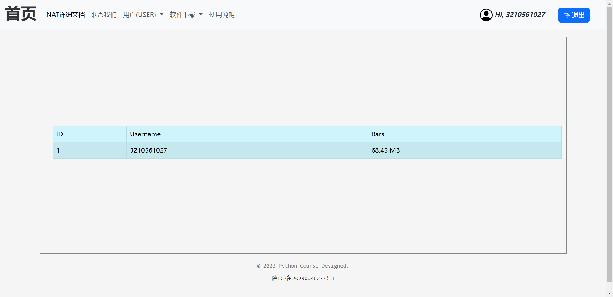

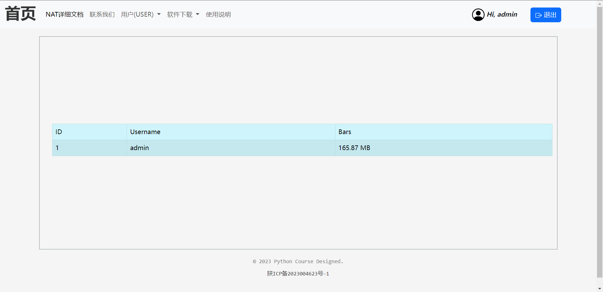

我们可以明确的看见，系统正确的将不同用户所对应的账单显示了出了，且正确的计算了，`byte`单位所对应的`MB`的值，测试成功。

## 6. 其他路由

```python
urlpatterns = [
    path('', views.home, name='home'),
    path('user-info/register', views.register, name='register'),
    path('user-info/login', views.login_view, name='login'),
    path('detail', views.detail, name='detail'),
    path('user-info', views.userInformation, name='information'),
    path('modify-password', views.modifyPassword, name='modify-password'),
    path('reset-password',views.resetPassword,name='reset-password'),
    path('contact', views.contact, name='contact'),
    path('bars', views.bar_list, name='bars'),
    path('download', views.download_file, name='download'),
    path('usage', views.usage, name='usage'),
    path('send-email-verification/', views.send_email_verification, name='send_email_verification'),
]
```

1. `''`：空路径，对应`views.home`视图函数，用于显示主页。
2. `user-info/register`：用户注册路径，对应`views.register`视图函数，用于处理用户注册逻辑。
3. `user-info/login`：用户登录路径，对应`views.login_view`视图函数，用于处理用户登录逻辑。
4. `detail`：详细信息路径，对应`views.detail`视图函数，用于显示开发`NAT`的详细信息。
5. `user-info`：用户信息路径，对应`views.userInformation`视图函数，用于显示用户信息。
6. `modify-password`：修改密码路径，对应`views.modifyPassword`视图函数，用于处理修改密码逻辑。
7. `reset-password`：重置密码路径，对应`views.resetPassword`视图函数，用于处理重置密码逻辑。
8. `contact`：联系路径，对应`views.contact`视图函数，用于显示联系页面。
9. `bars`：展示`bars`路径，对应`views.bar_list`视图函数，用于展示`bars`列表。
10. `download`：下载路径，对应`views.download_file`视图函数，用于处理文件下载逻辑。
11. `usage`：使用情况路径，对应`views.usage`视图函数，用于显示使用情况页面。
12. `send-email-verification/`：发送邮件验证路径，对应`views.send_email_verification`视图函数，用于处理发送邮件验证码逻辑。

## 7. 展望

`Dj-NAT`项目大致就已经完成了，后续呢，计划添加一个售卖服务的功能，即就是`bars`展示的那块，用户可以通过购买流量来使用对应的内网`NAT`服务。

项目的不足：

1. 用户密码加密：对于用户密码，应该使用加密算法进行处理，以增加数据安全性。可以使用哈希算法，如bcrypt或SHA-256等，在存储密码时进行加密处理，并在用户登录时进行验证。
2. 模块独立性：确保模块之间的独立性和解耦，以提高代码的可维护性和可扩展性。可以通过定义清晰的接口和抽象层，以及采用设计模式和组件化思想，将功能模块进行分离和解耦。
3. 前后端分离：考虑将前端代码和后端代码进行分离，采用前后端分离的架构。可以使用现代前端框架（如React、Vue.js）开发前端应用，与后端通过API进行通信，实现前后端解耦，提高开发效率和用户体验。
4. Django用户认证框架：Django本身提供了完善的用户认证框架，包括用户注册、登录、密码重置等功能。考虑在项目中使用Django的用户认证框架，以减少重复开发和提高安全性。
5. 缓存和消息队列：考虑使用缓存（如Redis）和消息队列（如RabbitMQ）来优化系统性能和提高可扩展性。通过使用缓存机制减轻数据库的压力，并使用消息队列实现异步任务处理和解耦。
6. 数据库缓存层：引入数据库缓存层（如Redis缓存）来减轻MySQL数据库的压力。通过将常用的查询结果存储在缓存中，以减少对数据库的频繁访问，提高响应速度和性能。

